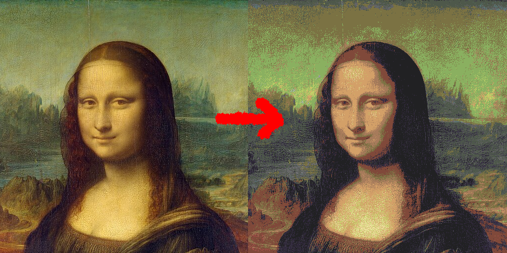

# huepatitis


## What is?

A tool that converts images to reduced palletes.



## How do?

<!-- in term example -->
```bash
huepatitis --image test_images/bigimage_mountain.jpg --palette palletes/a.p -o 4kpo.png
```

## Notes:
- takes up to 2 seconds for 8k images, mostly for compression, but otherwise is fast
- great place to get palette: https://lospec.com